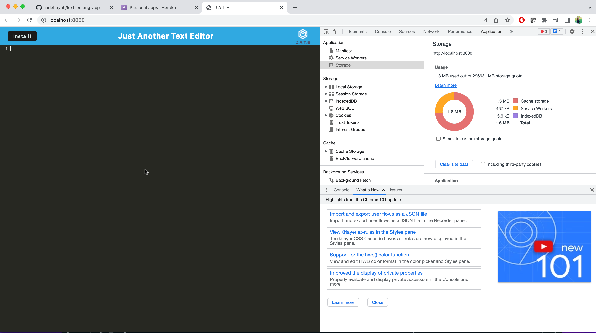
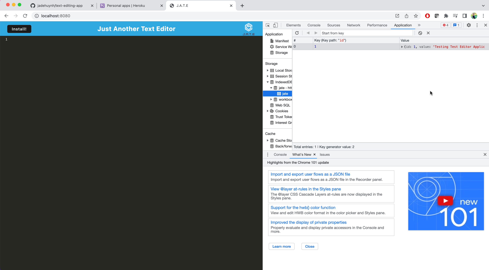

# J.A.T.E. Text Editing Application

----

## Welcome to the Just Another Text Editor Application!

----

This application uses amnifest file and webpacks to ensure the program is functional and working. The content will be saved with IndexDb, which creates the database storage! 

----

[GitHub Repository](https://github.com/jadehuynh/text-editing-app)

[Heroku Live Link](https://fathomless-escarpment-55030.herokuapp.com/)

----

## Images of Application

---

### Clear Storage before adding text/content to application

----

### Once test is added and refresh, data is saved in local storage

